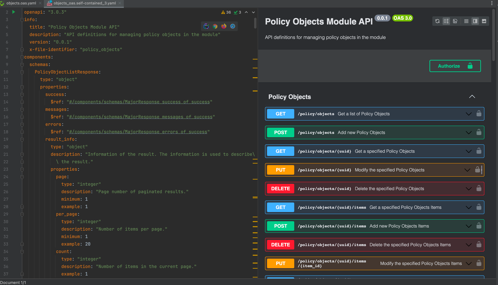

# Open API

- [基于 openapi.yaml 的 Mock API Server](https://docs.stoplight.io/docs/prism/83dbbd75532cf-http-mocking) 
- [基于 openapi.yaml 生成 SDK](https://github.com/OpenAPITools/openapi-generator)
- [根据 json schema 仿造数据](https://github.com/json-schema-faker/json-schema-faker)
- [将多个 openapi 文件组装为一个 openapi 文件](https://redocly.com/docs/cli/)
- 根据 openapi 生成文档框架：
    - https://github.com/Redocly/redoc
    - https://github.com/stoplightio/elements `CF使用`
- API 规范治理：
    -  https://redocly.com/docs/cli/api-standards/
- 其他产品Open API 参考
  - https://bump.sh/paul-gh/doc/gitlab/operation/operation-accessrequestsprojects_post
  - https://gitlab.com/gitlab-org/gitlab/-/blob/master/doc/api/openapi/openapi.yaml
- Jetbrains 插件 JSON/YAML格式转OpenAPI显示
  - https://plugins.jetbrains.com/plugin/index?xmlId=org.moniaga.openapi&utm_source=product&utm_medium=link&utm_campaign=GO&utm_content=2023.3

  