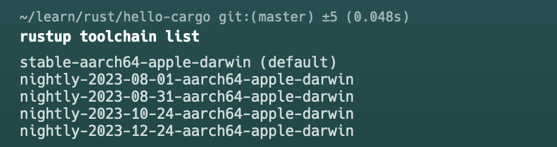
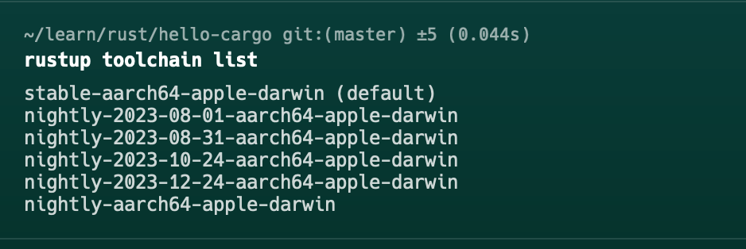
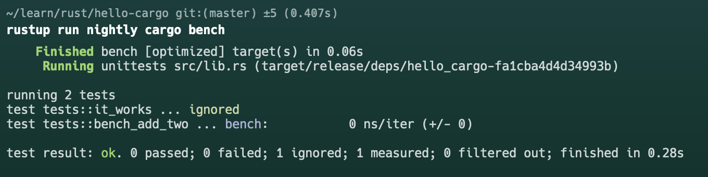

# Rust benchmark 使用指南

## 编写 src/lib.rs

```rust
#![feature(test)]

extern crate test;

pub fn add_two(a: i32) -> i32 {
    a + 2
}

#[cfg(test)]
mod tests {
    use super::*;
    use test::Bencher;

    #[test]
    fn it_works() {
        assert_eq!(4, add_two(2));
    }

    #[bench]
    fn bench_add_two(b: &mut Bencher) {
        b.iter(|| add_two(2));
    }
}
```

## 运行 cargo bench 如果抱这个错误信息，我们需要安装 `nightly`

> error[E0554]: `#![feature]` may not be used on the stable release channel

stable编译使用的channel还没有包含#![feature]功能需要安装`nightly`来运行

## 首先我们查看当前的环境是什么版本的

```shell
rustup toolchain list
```

目前只环境安装了stable



需要安装nightly

```shell
rustup toolchain install nightly
```



## 安装怎么使用

### 比较简单的方式是直接安装加更改当前系统默认的channel

> 这种方式连上面的安装步骤都一起做了，直接再执行cargo build 都是使用的nightly channel编译构建项目了，也就是原来使用stable的项目现在也改成nightly了
    
```shell
rustup default nightly
```

### 使用rustup run指定channel

> 想用nightly版本，可以使用rustup run nightly cargo [command]
    
```shell
rustup run nightly cargo build
```

### 使用rustup overwrite设置当前项目使用的channel 

> 在当前项目使用nightly，不影响其它项目

```shell
rustup override set nightly
```

## 运行 benchmark

```shell
rustup run nightly cargo bench
```

