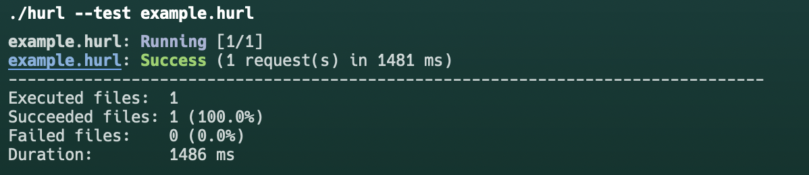
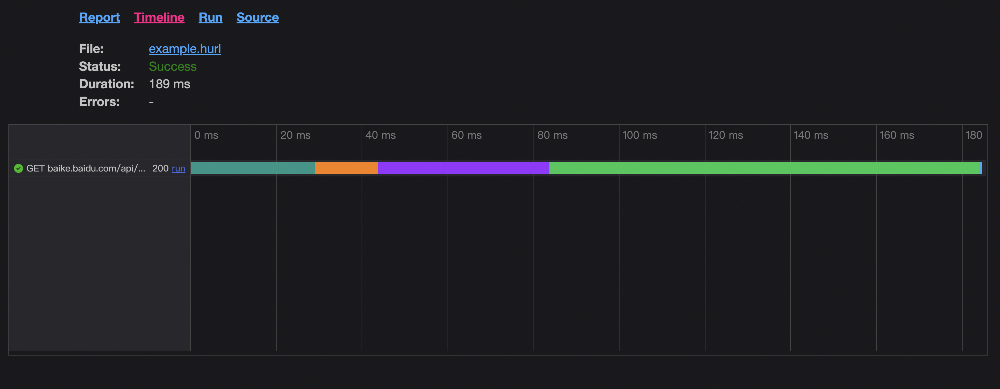

# hurl

[hurl](https://github.com/Orange-OpenSource/hurl)是一款基于Rust开发的命令行工具，以简单的纯文本格式定义的HTTP请求。也可以是HTTP的测试工具。

## 使用 [下载](https://github.com/Orange-OpenSource/hurl/releases/)

### 编写 example.hurl 文件

```content
GET https://example.com

HTTP 200
```

### 执行example.hurl

```shell
./hurl --test example.hurl
```



### 使用占位符

```content
GET {{domain}}

HTTP 200
```

```shell
./hurl --test example.hurl --variable domain=https://example.com
```

### [使用断言](https://hurl.dev/docs/tutorial/adding-asserts.html)

```content
GET https://baike.baidu.com/api/openapi/BaikeLemmaCardApi?scope=103&format=json&appid=379020&bk_key=%E9%93%B6%E9%AD%82&bk_length=600

HTTP 200
[Asserts]
jsonpath "$.key" != null
jsonpath "$.key" == "银魂"
jsonpath "$.card" count == 16
jsonpath "$.card[0].key" != "key"
```

### 生成报表

```shell
./hurl --test example.hurl --report-html .
```



### [更多功能](https://hurl.dev/docs/manual.html#options)

### [integration](https://hurl.dev/docs/tutorial/ci-cd-integration.html)