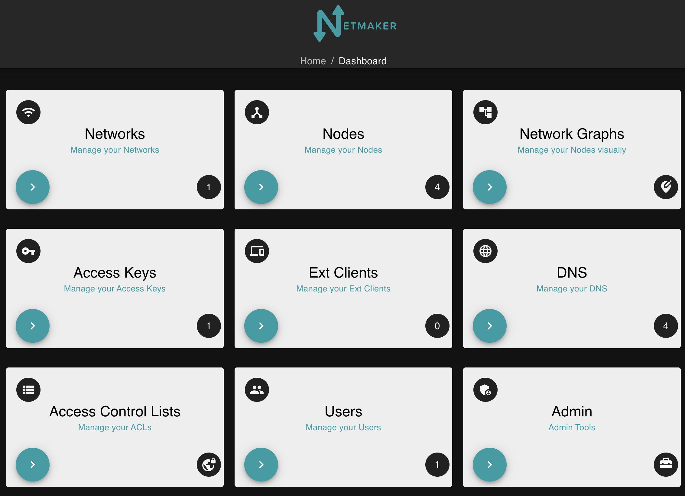
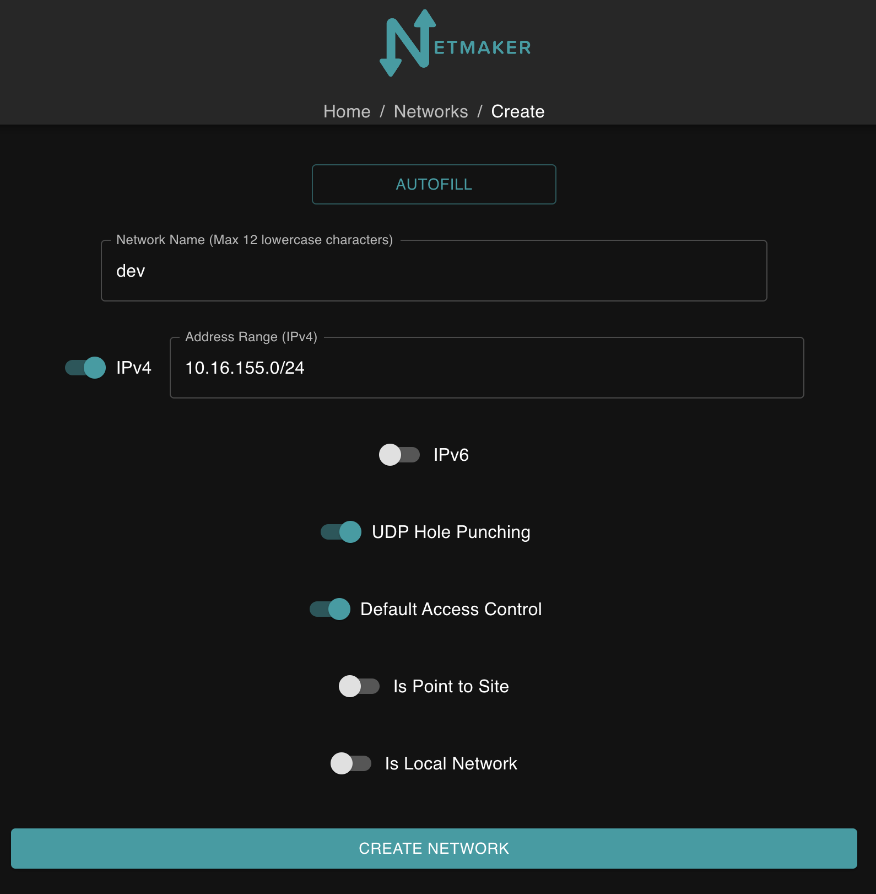
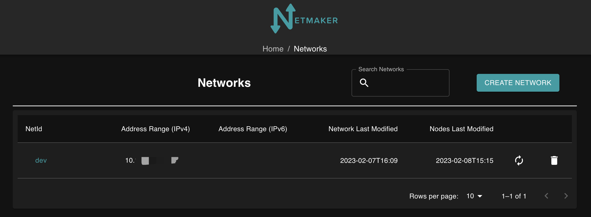
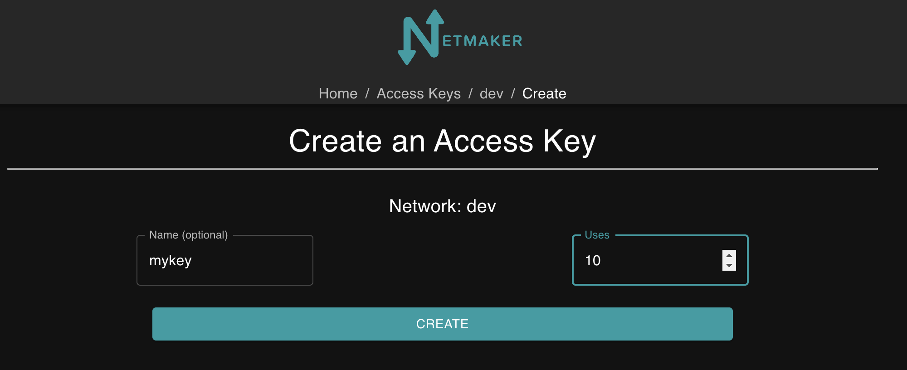
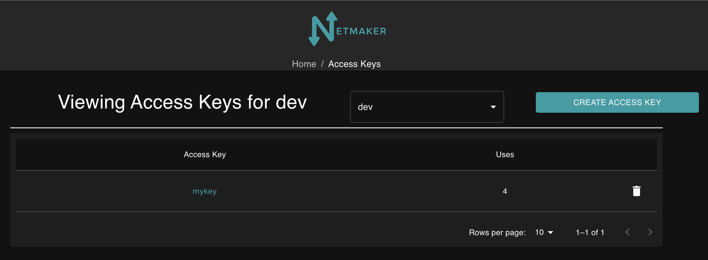
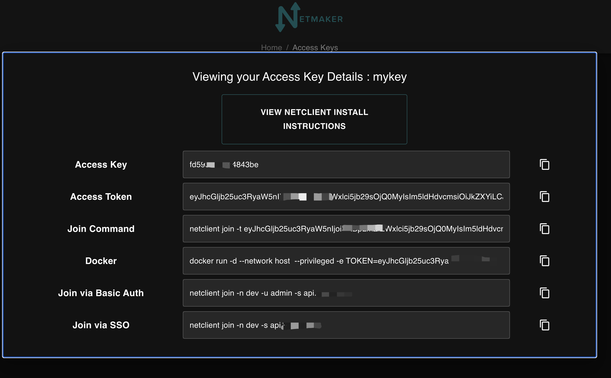
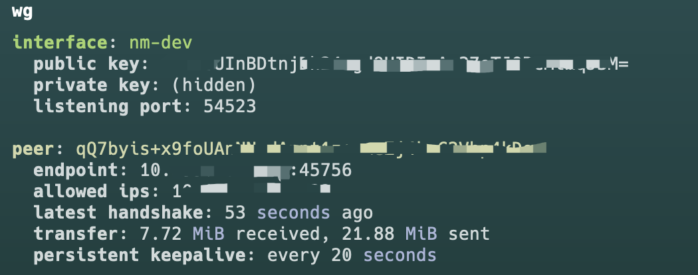

# K3s跨云厂商部署

为什么要打造跨云厂商部署，因为云服务资源非常有限的，部署容器效率等等方面，造成这么一需求来，本篇采用k3s做为方案

## Wireguard

[Wireguard](https://www.wireguard.com/) 能让处于不同网络的主机组成一个子网，是一种高性能的廉价组网方案，是基于最前沿密码学构建的轻量、快速、安全、现代化的开源VPN
Wireguard还是个跨平台，小到微型嵌入式设备，大到超级计算机，常用Windows、MacOS、Linux、iOS和安卓操作系统平台，WireGuard都能按照预期高效运行，该代码将被合并到到Linux主线5.6内核中

## Netmaker

[Netmaker](https://github.com/gravitl/netmaker) 是一个用来配置 WireGuard 全互联模式的可视化工具，它的功能非常强大，不仅支持 UDP 打洞、NAT 穿透、多租户，还可以使用 Kubernetes 配置清单来部署，客户端几乎适配了所有平台，包括 Linux, Mac 和 Windows，还可以通过 WireGuard 原生客户端连接 iPhone 和 Android

## K3s

[K3s](https://docs.k3s.io/) 是一个完全兼容，轻量级的 Kubernetes 发行版

# 环境准备

需要三台机器，一个公网IP

## 机器清单

| Node   | Local  | IP       | Network        | OS                 | Specification |
| ------ | ------ | -------- | -------------- | ------------------ | ------------- |
| Master | aliyun | 1.x.x.x  | VPC/EIP        | Ubuntu 22.04.1 LTS | 2C2G          |
| Node1  | VM     | 10.x.x.x | Lan Private IP | Centos 7           | 8C8G          |
| Node2  | VM     | 10.x.x.x | Lan Private IP | Centos 7           | 2C4G          |

## 内核升级

目前wg已经被合并到5.6内核了，如果你的机器内核大于这个版本，你需要装**wireguard-tools**工具即可，升级内核或者下载wireguard工具该链接如下

[Installation - WireGuard](https://www.wireguard.com/install/)

```shell
apt install wireguard
wg --version
```

## 网络规划与部署

Wireguard可以使用wg命令操作，操作wg有Netmaker和Wg Gen Web易用的工具，这里使用Netmaker

### 安装Netmaker

Netmaker 需要安装到有公网IP节点上[Master]

另外还需要域名，如果不需要域名，下载好自行把对应的domain改成IP

```
dashboard.example.com
api.example.com
broker.example.com
nm.example.com
```

安全防火墙需要放行 **TCP:80 443 UDP:51820-51830**

```shell
wget -qO /root/nm-quick-interactive.sh https://raw.githubusercontent.com/gravitl/netmaker/master/scripts/nm-quick-interactive.sh && sudo chmod +x /root/nm-quick-interactive.sh && sudo /root/nm-quick-interactive.sh
```

### 访问Netmaker

- 访问`https://dashboard.<your domain>`



### 创建网络

输入名称和IP，不想操作可以点击AUTOFILL，创建成功在列表会显示dev





### 创建Access Key

**name** 设置密钥的名称

**uses** 代表这个网络能使用多少节点，这里设置为10







### 安装netclient

[使用教程](https://docs.netmaker.org/netclient.html)

```shell
curl -sL 'https://apt.netmaker.org/gpg.key' | sudo tee /etc/apt/trusted.gpg.d/netclient.asc
curl -sL 'https://apt.netmaker.org/debian.deb.txt' | sudo tee /etc/apt/sources.list.d/netclient.list
apt update
apt install netclient
netclient -v
```

建立链接

```shell
netclient join -t <AccessToken>
```

建立链接

```shell
netclient connect -n dev
```

断开链接

```shell
netclient disconnect -n dev
```

### 验证网络

```shell
wg
```



## 安装k3s

[安装使用教程](https://docs.k3s.io/zh/installation/configuration)

#### 要求

两个节点不能具有相同的主机名。如果多个节点有相同的主机名，

使用`--with-node-id`选项为每个节点附加一个随机后缀，或者使用`--node-name`或`$K3S_NODE_NAME`为添加到集群的每个节点设计一个独特的名称

### 硬件

最少使用2c2g

### 网络

K3s Server 需要 `6443` 端口才能被所有节点访问

使用 `Flannel Wireguard` 后端时，节点需要能够通过 UDP 端口 `51820` 和 `51821`（使用 IPv6 时）访问其他节点。该节点不应侦听任何其他端口。K3s 使用反向隧道建立节点与 Server 的出站连接，所有 kubelet 流量都通过该隧道进行。但是，如果你不使用 Flannel 并提供自己的自定义 CNI，那么 K3s 不需要 Flannel 所需的端口

本篇文档使用 wg 打通需要flannel cni配合

#### 在[node1]安装k3s server

 [flannel 使用教程](https://docs.k3s.io/zh/reference/server-config#agent-%E7%BD%91%E7%BB%9C)

为什么要在 `node1` 节点安装k3s server，是因为云服务资源不够，需要在内网安装，内部服务器随便折腾

使用国内链接下载，server exec `flannel-iface` 加上wg定义的网卡名称

安装

```shell
curl -sfL https://rancher-mirror.rancher.cn/k3s/k3s-install.sh | INSTALL_K3S_MIRROR=cn INSTALL_K3S_EXEC="server --flannel-iface nm-dev" sh -
```

停止

```shell
sh /usr/local/bin/k3s-killall.sh
```

卸载

```shell
sh /usr/local/bin/k3s-uninstall.sh
```

获取token

```shell
cat /var/lib/rancher/k3s/server/node-token
```

查看节点

```shell
kubectl get nodes
```

#### 在[master/node2]安装k3s agent

安装

`10.x.x.x` 是 `node1 wg`的ip

`public ip` 是对外显示的ip

```shell
curl -sfL https://rancher-mirror.rancher.cn/k3s/k3s-install.sh | INSTALL_K3S_MIRROR=cn K3S_URL=https://10.x.x.x:6443 K3S_TOKEN=<token> INSTALL_K3S_EXEC="agent --flannel-iface nm-dev --node-external-ip <public ip>" sh -
```

卸载

```shell
sh /usr/local/bin/k3s-agent-uninstall.sh
```

将[node1]文件移动到对应的master/node2节点，否则agent 无法执行 `kubectl` 命令

```shell
scp -r /etc/rancher/k3s/k3s.yaml root@[master/node2]:/etc/rancher/k3s/
```

在master/node2节点修改k3s.yaml

```
server: https://{node1}:6443
```

添加变量

```shell
echo "export KUBECONFIG=/etc/rancher/k3s/k3s.yaml" >> ~/.bash_profile
source ~/.bash_profile
```

查看节点

```shell
kubectl get nodes
```

## 验证部署

创建 namespace

```shell
kubectl create namespace dev
```

创建 `nginx.yaml` 文件

```yaml
apiVersion: apps/v1
kind: Deployment
metadata:
  name: pc-deployment
  namespace: dev
spec:
  replicas: 3
  selector:
    matchLabels:
      app: nginx-pod
  template:
    metadata:
      labels:
        app: nginx-pod
    spec:
      containers:
      - name: nginx
        image: nginx:latest
        ports:
        - containerPort: 80


---

apiVersion: v1
kind: Service
metadata:
  name: service-nodeport
  namespace: dev
spec:
  selector:
    app: nginx-pod
  type: LoadBalancer
  ports:
  - port: 30800
    targetPort: 80
```

执行文件

```shell
kubectl create -f nginx.yaml
```

查看pod,svc

```shell
kubectl get pods,svc -n dev -owide
```

访问部署各个节点nginx

```shell
curl -I http://<public ip>:30800
```
