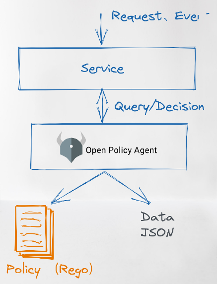
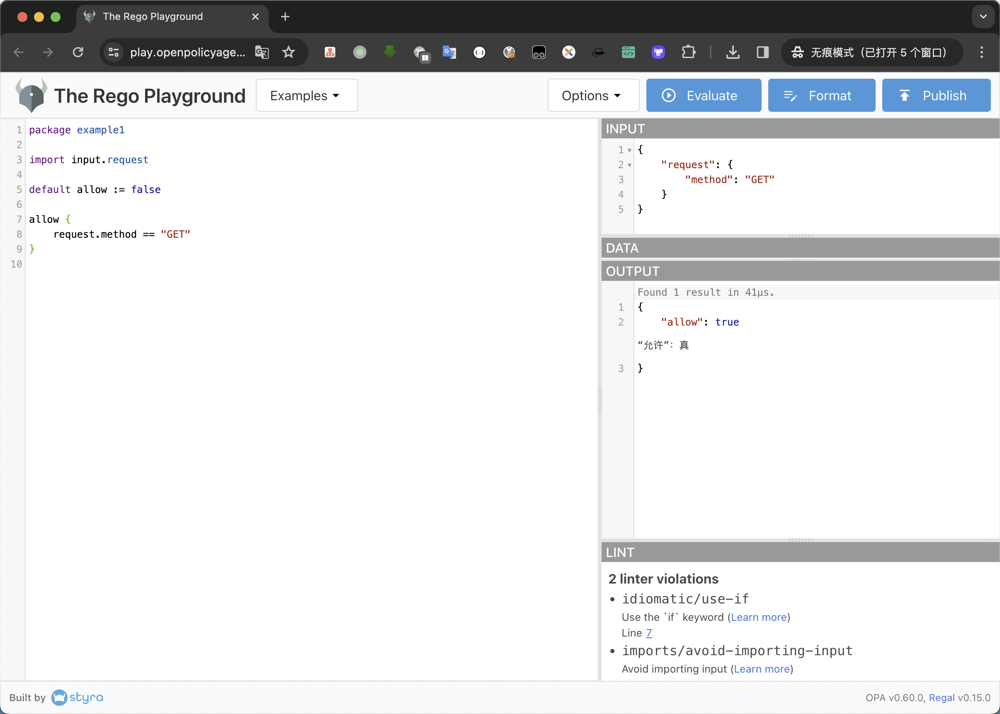
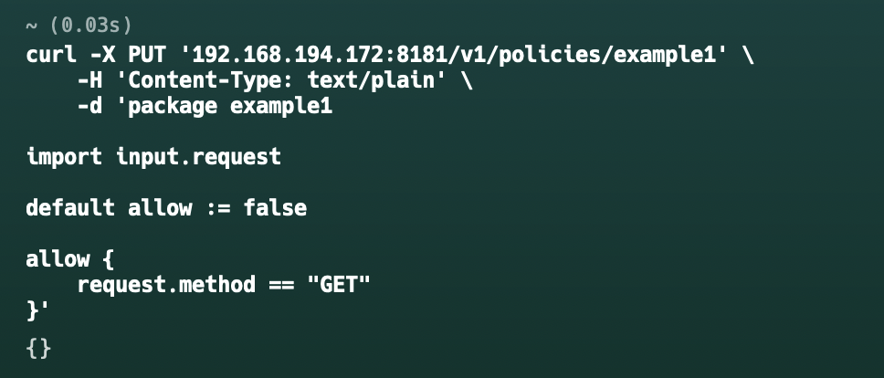
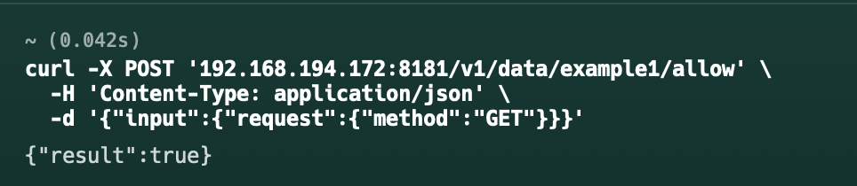
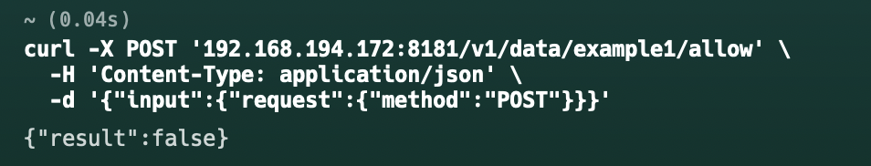

# 开放策略代理（OPA）

[OPA](https://github.com/open-policy-agent/opa)，全称 Open Policy Agent（开放策略代理），CNCF 中的毕业项目。

# OPA 是什么

OPA是一种开源的通用的策略引擎，可以在整个堆栈中实现统一、上下文感知的策略控制。



OPA不负责具体任务的造型，它负责决策，需要决策的请求通过JSON的方式传递给OPA，在OPA决策后，也会将结果以JSON的形式返回。

# 使用教程

> 没有环境的话可以去[官方网站](https://play.openpolicyagent.org/)上操作



## 安装OPA

```shell
docker run -d --name opa -p 8181:8181 openpolicyagent/opa:latest run -s
```

## 添加策略

```shell
curl -X PUT '127.0.0.1:8181/v1/policies/example1' \
    -H 'Content-Type: text/plain' \
    -d 'package example1

import input.request

default allow := false

allow {
    request.method == "GET"
}'
```




## 查询策略

```shell
curl -X POST '127.0.0.1:8181/v1/data/example1/allow' \
  -H 'Content-Type: application/json' \
  -d '{"input":{"request":{"method":"GET"}}}'
```

### 成功的resp



### 失败的resp



# GO使用OPA规则

```go
package main

import (
	"context"

	"github.com/open-policy-agent/opa/rego"
)

func main() {
	mod := `
	package test
	import future.keywords.if
	
	default allow := false
	
	allow if {
	    input.x == 1
	}
	`

	pq, err := rego.New(
		rego.Query("data.test.allow"),
		rego.Module("test.rego", mod),
		rego.Input(map[string]interface{}{"x": 1})).PrepareForEval(context.Background())
	if err != nil {
		panic(err)
	}

	result, err := pq.Eval(context.Background())
	if err != nil {
		panic(err)
	}
	print(result.Allowed())
}
```
